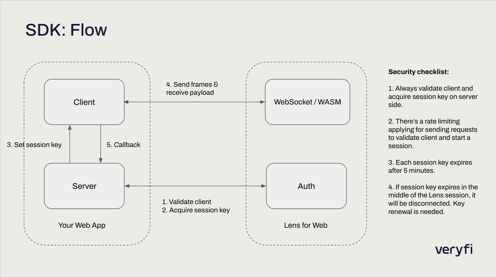

# Veryfi Lens for Web SDK Demo

Veryfi Lens for Web SDK is a framework for your web app to give it document capture superpowers in minutes.

This project is a demo to showcase how you can integrate Lens into your web app. It follows a client-server architecture where the server is for validating your client and getting session key and the client side is for displaying and showing Lens components for capturing documents.

There are two ways of using Lens for Web:
1. WebSocket (Only usual receipts, easy to install, slower than WASM)
2. WASM (Usual and Long Receipts, very fast, some devices are not supported)

# WebSocket
1. Import package `import VeryfiLens from 'veryfi-lens-wasm'`
   or `const lens = require('veryfi-lens-wasm').default` inside `useEffect` for next.js
2. Add `id='veryfi-container'` to a div you want lens to appear (it should have full height and hidden overflow)
3. Set your client ID and request a sessionToken (LensScreen.tsx in this demo)  
 

# WASM
**_You can skip first step and copy wasm folder from package directory manually if you want to do so_.**

1. run `npm exec veryfi-lens-wasm-setup` and provide it with path to directory where
   **they have to be accessible from your project's entry point with relative paths** (for next.js `public/wasm`)
2. Import package `import VeryfiLens from 'veryfi-lens-wasm'`
   or `const lens = require('veryfi-lens-wasm').default` inside `useEffect` for next.js
3. Add `id='veryfi-container'` to a div you want lens to appear (it should have full height and hidden overflow)
4. Create .env file and add your client_id (NEXT_PUBLIC_CLIENT_ID)

